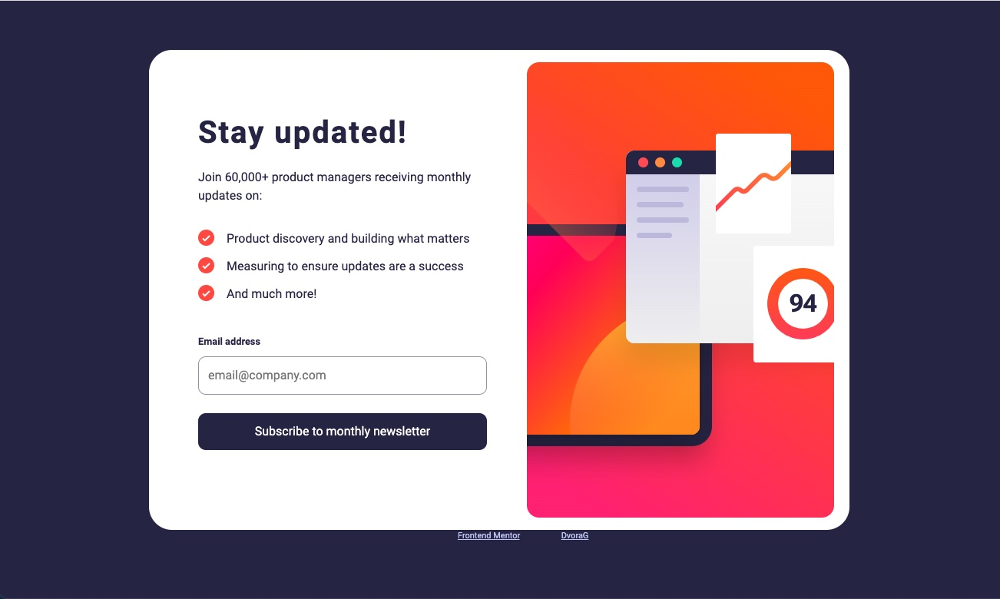

# Frontend Mentor - Newsletter sign-up form with success message solution

This is a solution to the [Newsletter sign-up form with success message challenge on Frontend Mentor](https://www.frontendmentor.io/challenges/newsletter-signup-form-with-success-message-3FC1AZbNrv). Frontend Mentor challenges help you improve your coding skills by building realistic projects.

## Table of contents

- [Overview](#overview)
  - [The challenge](#the-challenge)
  - [Screenshot](#screenshot)
  - [Links](#links)
- [My process](#my-process)
  - [Built with](#built-with)
  - [What I learned](#what-i-learned)
  - [Continued development](#continued-development)
- [Author](#author)

## Overview

### The challenge

Users should be able to:

- Add their email and submit the form
- See a success message with their email after successfully submitting the form
- See form validation messages if:
  - The field is left empty
  - The email address is not formatted correctly
- View the optimal layout for the interface depending on their device's screen size
- See hover and focus states for all interactive elements on the page

### Screenshot

### Links

- Solution URL: https://github.com/DvoraG/newsletter-sign-up
- Live Site URL: https://dvorag.github.io/newsletter-sign-up/

## My process

Usually I would start to setup the desktop structure first in HTML, but this time I found it easier to begin 'mobile first' in the HTML too.

In the next step I added the styling and only when this was ready, I started to implement the functionality with JavaScript.

For the validity check of the email I used the solution found on https://www.w3schools.blog/email-validation-javascript-js. I chose this approach here, for demonstrating the success and error messaging only.

### Built with

- Semantic HTML5 markup
- CSS custom properties
- Flexbox
- CSS Grid
- Mobile-first workflow
- Vanilla JavaScript

### What I learned

First time I tried the BEM naming convention, which I found very helpful to create a better understandable code. Still, there is much left to learn.

### Continued development

For sure my JS coding needs a lot of polishing.

## Author

- Frontend Mentor - [@yDvoraG](https://www.frontendmentor.io/profile/DvoraG)
